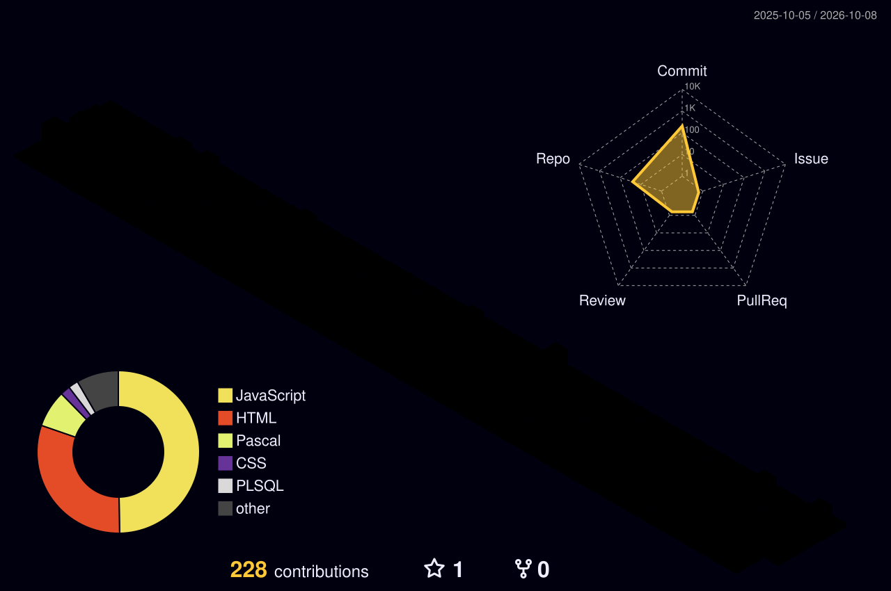

<div align="center">


<br/>

<a href="https://github.com/syamaydev"></a>
<a href="mailto:syahrilmaymubdi2505@gmail.com"></a>
<a href="https://www.instagram.com/syahrilmaimubdymandai/"></a>
<a href="https://www.facebook.com/syahrilmaimubdy/"></a>
<a href="https://www.youtube.com/c/channelbelajar"></a>


</div>

<br/>


## 🧠 About Me

```ts
const syahril = {
  role: "Web Developer",
  location: "Indonesia 🇮🇩",
  focus: ["Frontend", "Backend", "UI/UX"],
  currentlyBuilding: "SI-Raju",
  currentlyLearning: "CodeIgniter 3",
  philosophy: "Code wants to be simple.",
};
```

I'm a developer who learns by building — starting from web fundamentals and growing into real projects, interactive apps, and polished interfaces.

- ⚡ Frontend development
- 🧩 Full-stack web applications
- 🎨 UI/UX & visual interfaces
- 🗄️ Database-driven systems
- 🚀 Shipping to production

<br/>

## 🔭 Right Now

<table width="100%">
<tr>
<td width="50%" valign="top">
<h3>🚀 Building</h3>
<b>SI-Raju</b><br/>
Web-based major recommendation system that helps users discover suitable study programs based on their interests.
</td>
<td width="50%" valign="top">
<h3>🌱 Learning</h3>
<b>CodeIgniter 3</b><br/>
Sharpening backend skills — database integration, MVC architecture, and structured application design.
</td>
</tr>
</table>

<br/>

## ⚙️ Tech Stack

<div align="center">

**Languages & Core**
<br/>


**Frameworks & Libraries**
<br/>


**Database & Backend**
<br/>


**Tools**
<br/>


</div>

<br/>


## 🚀 Featured Projects

<table width="100%">
<tr>
<td width="50%" valign="top">


Recommendation system that helps users discover suitable university majors through an interactive quiz.


**[🔗 Live Demo](https://syamaydev.github.io/react-sistemrekomendasijurusan/)**

</td>
<td width="50%" valign="top">


Financial management web app to help users organize and monitor personal finances.


**[🔗 Repository](https://github.com/syamaydev?tab=repositories)**

</td>
</tr>
<tr>
<td width="50%" valign="top">


Management system for organization info, members, events, articles, and administration.


</td>
<td width="50%" valign="top">


School bullying reporting platform with a simple reporting flow and a counselor dashboard.


</td>
</tr>
</table>

<br/>


## 📊 Metrics & Activity

<div align="center">
  
</div>

<br/>

<div align="center">
  
</div>

<br/>

<div align="center">
  <picture>
    <source media="(prefers-color-scheme: dark)" srcset="https://raw.githubusercontent.com/syamaydev/syamaydev/output/snake-dark.svg"/>
    <source media="(prefers-color-scheme: light)" srcset="https://raw.githubusercontent.com/syamaydev/syamaydev/output/snake.svg"/>
    
  </picture>
</div>

<br/>


<div align="center">

### 📫 Let's Connect

<a href="mailto:syahrilmaymubdi2505@gmail.com"></a>
<a href="https://www.instagram.com/syahrilmaimubdymandai/"></a>
<a href="https://www.facebook.com/syahrilmaimubdy/"></a>
<a href="https://www.youtube.com/c/channelbelajar"></a>

<br/><br/>


<sub><b>Building. Learning. Shipping. Repeating.</b></sub>

</div>
